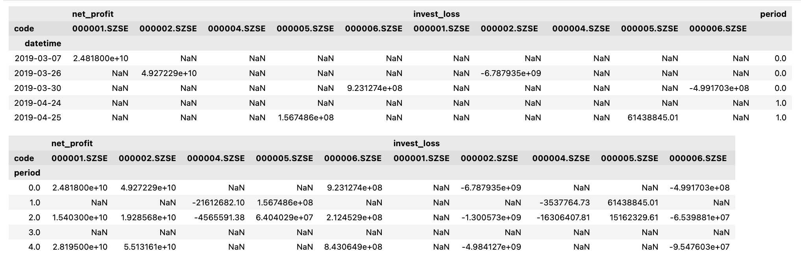
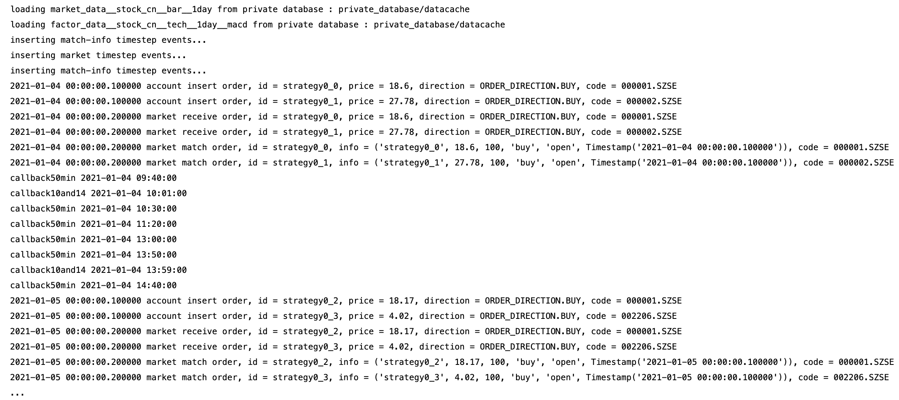
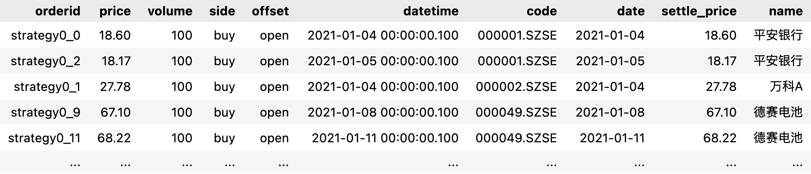
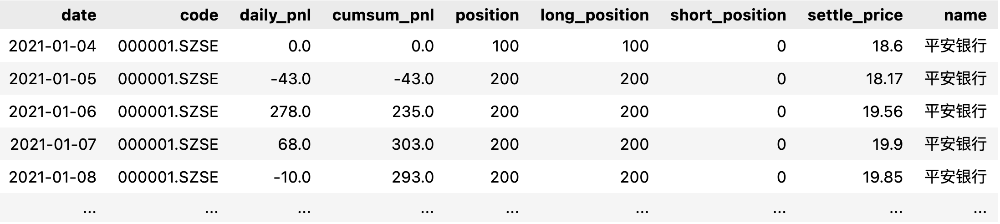
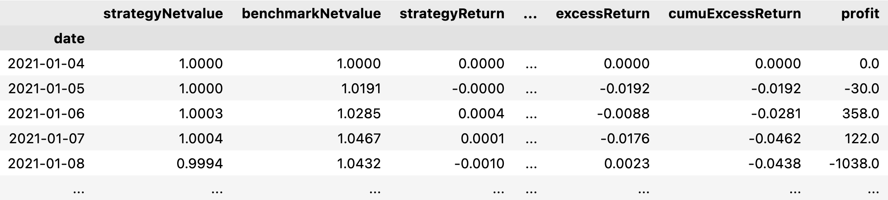
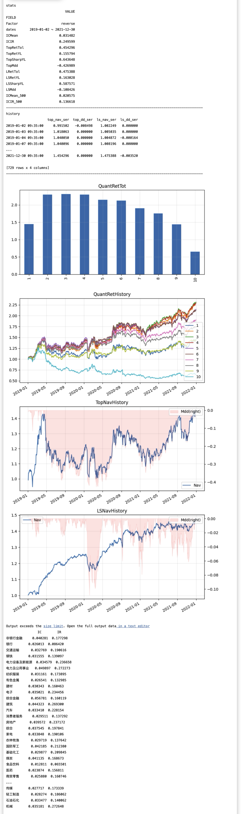

# Transmatrix 使用手册

更新日期： 2022年10月30日


推荐使用在线版本： https://zhang-yuanye.github.io/transmatrix-online-doc/#/

## 数据api

### Dataset 
>用于描述一个数据集合
- 参数:
    >名称|类型|说明
    >---|---|---
     table_name|String|表名
     strat_time/end_time|[str, datetime, date] |开始 / 结束 时间 
     codes|list（指定集合） / '*'（取表中所有代码） / None(defualt, 取表中所有代码)|股票代码集合
     fields|list（指定集合） / '*'（取表中所有字段） / None(defualt, 取表中所有字段)|字段集合
     panel_catagory|'price-volume' / 'finance-report', defalut|区分是否是财报数据
- 函数接口:
  - load_data  #加载数据
  
  代码样例:


    from transmatrix.data_api import Dataset

    dataset = Dataset(
        table_name = 'stock__bar__1day',
        start_time = '20210101',
        codes = ['000001.SZSE','000002.SZSE'],
        fields = ['open','high','low','close','volume'],
        end_time = '20210120',
    )  # 构建数据集

    dataset.load_data() #加载数据
    type(dataset.data)  #加载后数据以Array3dPanel的形式保存在.data属性中
---
    Out:
    transmatrix.data_api.panel_engine.panel_database.Array3dPanel

### Array3dPanel 
 > 数据集合对象
 - 属性列表:
    >名称|说明
    >---|---
     data | ndarray 数据
     idx  | 时间戳序列
     fields | 字段集合
     codes  | 代码集合
     cursor | 当前游标位置 <br>初始化为-1，由回测引擎控制。 <br> 给定回测引擎时间T，游标为idx中T时刻之前最新一条数据对应的序号。

  代码样例:


    In：
    type(dataset.data)
    dataset.data.shape
    dataset.idx
    dataset.fields
    dataset.codes
    dataset.cursor

---
    Out:
    numpy.ndarray
    (12, 5, 2)
    {Timestamp('2021-01-04 15:00:00'): 0,
    Timestamp('2021-01-05 15:00:00'): 1,
    Timestamp('2021-01-06 15:00:00'): 2,
    Timestamp('2021-01-07 15:00:00'): 3,
    Timestamp('2021-01-08 15:00:00'): 4,
    Timestamp('2021-01-11 15:00:00'): 5,
    Timestamp('2021-01-12 15:00:00'): 6,
    Timestamp('2021-01-13 15:00:00'): 7,
    Timestamp('2021-01-14 15:00:00'): 8,
    Timestamp('2021-01-15 15:00:00'): 9,
    Timestamp('2021-01-18 15:00:00'): 10,
    Timestamp('2021-01-19 15:00:00'): 11}

    {'low': 0, 'volume': 1, 'close': 2, 'high': 3, 'open': 4}
   
    {'000001.SZSE': 0, '000002.SZSE': 1}

    -1

---
--- 
- 构造方法:
    - 1. 利用 Dataset.load_data （见上文）
    - 2. from_dataframes
        - 类方法
        - 通过形为 {name : pd.Dataframe} 的字典实例化数据集合

  代码样例


    In:
    from transmatrix.data_api import Array3dPanel

    idx = list(pd.date_range('20210101 09:30:00','20210105 09:30:00'))
    codes = ['000001.SZSE','000002.SZSE']

    panelA = pd.DataFrame(index = idx, columns = codes).fillna(1) 
    panelB = pd.DataFrame(index = idx, columns = codes).fillna(2) 

    panel3d = Array3dPanel.from_dataframes({'A': panelA, 'B': panelB})

    panel3d.data.shape
    panel3d.idx
    panel3d.fields
    panel3d.codes
---
    Out:
    (5, 2, 2)

    {Timestamp('2021-01-01 09:30:00'): 0,
    Timestamp('2021-01-02 09:30:00'): 1,
    Timestamp('2021-01-03 09:30:00'): 2,
    Timestamp('2021-01-04 09:30:00'): 3,
    Timestamp('2021-01-05 09:30:00'): 4}

    {'A': 0, 'B': 1}

    {'000001.SZSE': 0, '000002.SZSE': 1}

---
---

  - to_dataframes
    - 将数据转化为形如 {name : pd.Dataframe} 的字典实例化数据集合

  代码样例


    In：
    panel3d.to_dataframes()
---
    Out:
    {'A':                      000001.SZSE  000002.SZSE
    2021-01-01 09:30:00            1            1
    2021-01-02 09:30:00            1            1
    2021-01-03 09:30:00            1            1
    2021-01-04 09:30:00            1            1
    2021-01-05 09:30:00            1            1,
    'B':                      000001.SZSE  000002.SZSE
    2021-01-01 09:30:00            2            2
    2021-01-02 09:30:00            2            2
    2021-01-03 09:30:00            2            2
    2021-01-04 09:30:00            2            2
    2021-01-05 09:30:00            2            2}
---

  - concate:  
    - 功能：向数据中加入新的字段 (同频拼接)
    - 参数：other(dataframe)

  代码样例


    In:
    other = Array3dPanel.from_dataframes(
        {
            'C':pd.DataFrame(index = idx, columns = codes).fillna(3),
            'D':pd.DataFrame(index = idx, columns = codes).fillna(4),
        }
    )
    panel3d.concat(other)

    panel3d.data.shape
    panel3d.idx
    panel3d.fields
    panel3d.codes
---
    Out:
    (5, 4, 2)
    {Timestamp('2021-01-01 09:30:00'): 0,
    Timestamp('2021-01-02 09:30:00'): 1,
    Timestamp('2021-01-03 09:30:00'): 2,
    Timestamp('2021-01-04 09:30:00'): 3,
    Timestamp('2021-01-05 09:30:00'): 4}
    {'A': 0, 'B': 1, 'C': 2, 'D': 3}
    {'000001.SZSE': 0, '000002.SZSE': 1}

---
- calibrate: 
  - 功能: 匹配timestamps, 保留有效数据。对于timestamps 中的任意一个时间戳, 匹配该时间之后的第一条数据。
  - 参数: tiemstamps(datetime)


  代码样例
  

    In:
    '校准后:'
    panel3d.calibrate(clock_steps)
    panel3d.data.shape
    panel3d.to_dataframes()
---
    Out:
    '校准后:'
    (5, 2, 2)
    {'twap':                      000001.SZSE  000002.SZSE
    2021-01-01 09:35:00            1            1
    2021-01-02 09:35:00            1            1
    2021-01-03 09:35:00            1            1
    2021-01-04 09:35:00            1            1
    2021-01-05 09:35:00            1            1,
    'vwap':                      000001.SZSE  000002.SZSE
    2021-01-01 09:35:00            2            2
    2021-01-02 09:35:00            2            2
    2021-01-03 09:35:00            2            2
    2021-01-04 09:35:00            2            2
    2021-01-05 09:35:00            2            2}

---


- query: 通过外部时间查询最新数据
  - 参数: 
    >名称|类型|说明
    >---|---|---
     time|datetime|表名
     periods |int | 返回N条数据
     start_time |datetime | 返回某时刻之后的数据
     window |timedelta | 返回一段时间的数据
    
  - 返回: 
    - 形如 {filed_name : dataframe}的字典

  代码样例


    In: 
    panel3d.query(datetime(2021,1,4,9,36), periods = 3)
---
    Out:
    {'twap':                      000001.SZSE  000002.SZSE
    2021-01-02 09:35:00            1            1
    2021-01-03 09:35:00            1            1
    2021-01-04 09:35:00            1            1,
    'vwap':                      000001.SZSE  000002.SZSE
    2021-01-02 09:35:00            2            2
    2021-01-03 09:35:00            2            2
    2021-01-04 09:35:00            2            2}
---
    In:
    panel3d.query(datetime(2021,1,4,9,36), start_time = datetime(2021,1,3,9,30))
---
    Out:
    {'twap':                      000001.SZSE  000002.SZSE
    2021-01-03 09:35:00            1            1
    2021-01-04 09:35:00            1            1,
    'vwap':                      000001.SZSE  000002.SZSE
    2021-01-03 09:35:00            2            2
    2021-01-04 09:35:00            2            2}
---
    In:
    panel3d.query(datetime(2021,1,4,9,36), window = timedelta(days=2))
---
    Out:
    {'twap':                      000001.SZSE  000002.SZSE
    2021-01-03 09:35:00            1            1
    2021-01-04 09:35:00            1            1,
    'vwap':                      000001.SZSE  000002.SZSE
    2021-01-03 09:35:00            2            2
    2021-01-04 09:35:00            2            2}


---
- get: 返回某个字段 *游标* 位置最新一条数据
    - 参数:
    >名称|类型
    >---|---
     fileds|[string]
     codes |[string] /string /* / None
    - 输出: array / float

- 样例


    In:
    panel3d.cursor = 3
    panel3d.get(field = 'twap')
    panel3d.get(field = 'twap', codes = '000001.SZSE')
---
    Out:
    array([1, 1])

    1

---
- get_fields: 返回多个字段 *游标* 位置最新一条数据
    - 参数:
    >名称|类型
    >---|---
     fileds|[string]
     codes |[string] /string /* / None

代码样例


    In:
    twap, vwap = panel3d.get_fields(['twap','vwap'])
    twap, vwap
---
    Out:
    (array([1, 1]), array([2, 2]))

---
- get_window:返回某个字段 *游标* 位置最新一条数据
    - 参数:
    >名称|类型|说明
    >---|---|---
     length|int|窗口长度
     filed |string| 字段名
     codes |[string]/ string/ * / None | 代码列表

  代码样例


    In:
    twap = panel3d.get_window(3,'twap')
    vwap = panel3d.get_window(3,'vwap')
    {'twap': twap,
    'vwap': vwap}
---    
    Out:
    {'twap': array([[1, 1],
    [1, 1],
    [1, 1]]),
    'vwap': array([[2, 2],
    [2, 2],
    [2, 2]])} 

### FinancePanelData (财报数据接口)

- 财报数据对象 
  - 通过Dataset构造
  - 底层为 multi-index dataframe

代码示例

    In:
    from transmatrix.data_api import FinancePanelData
    codes = ['000001.SZSE','000002.SZSE','000004.SZSE','000005.SZSE','000006.SZSE']

    finpanel : FinancePanelData \
            = Dataset(
                table_name = 'ashare_cashflow',
                start_time = '20190101',
                end_time = '20210101',
                codes = codes,
                fields = ['net_profit','invest_loss'],
                #指定返回财报数据结构
                panel_catagory = 'finance-report' # 默认为 price-volume 即非财报（基本面）数据
                ).load_data()

    type(finpanel)
---
    Out:
    transmatrix.data_api.panel_engine.panel_database.FinancePanelData

- 属性列表:
    - data   : 全量数据（multi-index dataframe)
    - period_group_data : 按财报期对齐后的数据 multi-index dataframe)
 


## 策略回测引擎
### Matrix 回测控制组件
- 配置回测信息

代码示例


    from transmatrix import SimMatrix, Scheduler
    from transmatrix.trader import BaseStrategy, StrategyConfig
    from transmatrix.utils.tools import get_universe

    # 获取可交易的股票池
    CODES = get_universe('project_simulation/custom_universe')
    config = SimMatrix.MatrixConfig(
        
        {   
            # 回测模式 ：模拟市场 / 信号交易
            'mode' : 'simulation', # signal

            # 回测区间 ：[开始时间， 结束时间]
            'backtest_span': ['2021-01-01','2021-12-31'],

            # 因子订阅 ： [因子名 ：[因子表名，股票代码列表，字段集合，初始化窗口（天）]]
            'factors' : {
                'macd' : ['factor_data__stock_cn__tech__1day__macd', CODES, 'value', 10]
            },

            # 账户参数 
            'ini_cash' : 1000000
            # 'market_type': 'stock_cn'
            # 'ini_positon' : {}
            # 'fee' : 0
        }
    )

    # 实例化回测控制器对象
    matrix = SimMatrix.BaseMatrix(config)


### Strategy 策略管理组件

  
代码示例


    继承模板类
    class Strategy(BaseStrategy)
---
    # 在Strategy类下实现回调函数：
    # 行情更新时回调
    def on_market_data_update(self, market):

        data = market.data
        macd = self.macd.query(self.time, 3)['value'][self.codes].mean().sort_values()
        
        buy_codes = macd.iloc[:2].index

        for code in buy_codes:
            # 获取某只股票的仓位
            pos = self.account.get_netpos(code)

            if  pos < self.max_pos:
                price = data.get('close', code)
                self.buy(price, 100, 'open', code, market.name)
---
    # 用户自定义回调 支持 定时、定频、条件触发等机制
    callback_per_50min = Scheduler.FixFreqScheduler(name ='fixTimeScheduler50min',freq = '50min', matrix = matrix) 
    callback_at_10and14 = Scheduler.FixTimeScheduler(name = 'fixfreq10_14',matrix = matrix, milestones= ['10:01:00','13:59:00'])

--- 
    # 编写定时定频回调逻辑
    # 回调执行逻辑：每50分钟
    def callback50min(self):
        #打印回测系统时间
        print('callback50min', self.time)
        
    # 回调执行逻辑：每天10点和14点
    def callback10and14(self):
        #打印回测系统时间
        print('callback10and14', self.time)


--- 
    # 配置策略参数

    strategy_cfg = StrategyConfig(
    {   
        # 策略名称
        'name': 'strategy0',

        # 订阅行情（用于on_market_data_update回调）
        'subscribe_info':[
            # 行情表名，代码列表
            ['market_data__stock_cn__bar__1day', CODES]
        ],

        'kwargs' : {
            'max_pos': 300
        }

        # 自定义做和引擎 ：引擎编写可开放给用户(基于transmatrix.Basematcher interface)
        # 'match_mod': 'DayMatcher' 

        # 设置 发单 / 撤单延迟 （模拟 交易系统 --> 交易所 延迟)
        # 'insert_deley' : '0ms'
        # 'cancel_deley' : '0ms',
        # 设置 回报延迟 （模拟 交易所 --> 交易系统 延迟)
        # 'receive_delay': '0ms',
    }
)

---

    # 实例化策略对象，传入matrix以实现策略注册
    strategy = Strategy(strategy_cfg, matrix)

--- 
    # 初始化回测引擎
    matrix.init()


--- 
    # 运行回测
    matrix.run()
    # 日志输出

--- 


--- 
    # 分析接口
    matrix.analyze()

    # 运行后在 strategy 对象的 post_trade_analysis属性中获得回测评价数据


代码示例

    In:
    strategy.post_trade_analysis.__dict__.keys()

---

    Out:
    dict_keys(['trade_table', 'daily_position', 'daily_netvalue', 'summary_stats'])

--- 

    In: # 查询交易记录
    strategy.post_trade_analysis.trade_table


    In: # 查询每日持仓
    strategy.post_trade_analysis.daily_position


    In: # 查询每日净值
    strategy.post_trade_analysis.daily_netvalue


  


## 因子研究引擎
### 开发组件

- 回测组件导入
```
from transmatrix.matrix import SignalMatrix 
import sys; sys.path.append('project_signal')
```
- 用户代码导入
```
from signal2weights import *            # 自定义函数库
from strategy import ReverseSignal      # 策略代码
from evaluator import Eval              # 策略评估代码
```
- 因子编写组件
  - 在项目目录下的strategy.py中编写策略
  - ReverseSignal继承了策略模板SignalStrategy
  
代码示例
```
  from transmatrix.matrix.signal.base import SignalStrategy
  from transmatrix.data_api import Array3dPanel
  from scipy.stats import zscore

  class ReverseSignal(SignalStrategy):
      # 回测开始前引擎自动运行pre_transform函数已完成用户定义的矢量计算
      def pre_transform(self):
          if 'reverse' not in self.pv.fields:
              pv = self.pv.to_dataframes()
              ret = (pv['close'] / pv['close'].shift(1) - 1).fillna(0)
              reverse = -ret.rolling(window = 5, min_periods = 5).mean().fillna(0)
              reverse = zscore(reverse, axis = 1)
              ap = (pv['open'] + pv['close'] + pv['high'] + pv['low']) / 4
              self.pv.concat(Array3dPanel.from_dataframes({'reverse' : reverse}))

      # 回测过程中用户根据用户自定义的clock（时间戳序列）回调 on_clock 函数已实现因子生成逻辑
      def on_clock(self):
        self.update_signal(self.pv.get(field = 'reverse', codes = '*'))
```

- 因子评价组件
  - 在项目目录下的evaluator.py中编写策略
  - Eval继承了策略模板BaseEvaluator

代码示例

```
from signal2weights import *
from transmatrix.matrix.signal.base import BaseEvaluator
import matplotlib.pyplot as plt


class Eval(BaseEvaluator):
    
    # 回测结束后引擎将评价组件订阅的数据与策略生成的信号进行撮合处理生成 critc_data
    # critc函数：基于 critic_data 对象计算因子评价结果。
    # _process_base, _process_500, _process_ind为具体计算逻辑（因空间所限未展示代码）
    # show函数：将评价结果可视化 （因空间所限未展示代码）

    def critic(self, critic_data):

        perf = {}
        perf.update(self._process_base(critic_data))

        stats = perf['stats']
        stats.update(self._process_500(critic_data))
        stats = pd.DataFrame(pd.Series(stats, name = 'VALUE'))
        stats.index.name = 'FIELD'
        perf['stats'] = stats

        perf.update(self._process_ind(critic_data))
        self.perf = perf
        return perf

    
    def show(self): 
    ...

```
  

### 参数设置
- 回测参数
```
mat_config = {   
    # 回测模式 ：模拟市场 / 信号交易
    'mode' : 'signal', # simulation

    # 回测区间 ：[开始时间， 结束时间]
    # 'backtest_span': [str(START), str(END)],
    'backtest_span': [START, END],

    # 股票代码列表
    'universe': CODES,

    # 是否剔除结算价异常的股票
    'check_codes' : False,

    # 因子订阅 ： [因子名 ：[因子表名，股票代码列表，字段集合，初始化窗口（天）]]
    'data': {
        'pv'       : ['stock__bar__1day', CODES, 'open,high,low,close,volume', 10],
        'cashflow' : ['ashare_cashflow',  CODES, 'net_profit,invest_loss',     10] 
    },

    'clock': '09:35:00', #TODO：测试日内多笔交易。

    # 账户参数 
    'ini_cash' : 1000000        
}
```
- 策略参数
```
stra_config = {
    'name': 'reverseSignal',
}
```
- 评价参数
```
eval_config = {
    'name': 'simpleAlaphaEval',
    'data': {
        'pv':   ['stock__bar__1day',CODES, 'open,high,low,close,volume', 10],
        'meta': ['stock__meta', CODES, 'is_300,is_500,industry1', 10]
    }
}
```
### 执行回测
```
mat = SignalMatrix(mat_config)
eval = Eval(eval_config, mat)
strategy = ReverseSignal(stra_config, mat)
mat.init()
mat.run()
```
### 评价报告
```
eval.show()
```
# transmatrx-
