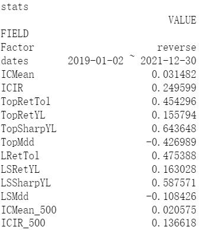

# 策略实例及完整流程
以下，我们将采用样本数据对进行完整的回测。
### 代码所需要导入的库
    from IPython.core.interactiveshell import InteractiveShell 
    InteractiveShell.ast_node_interactivity = "all"
    import pickle
    from datetime import date
    # 回测控制组件
    from transmatrix.matrix import SignalMatrix
    # 用户代码
    from signal2weights import *            # 自定义函数库
    from strategy import ReverseSignal      # 策略代码
    from evaluator import Eval              # 策略评估代码
    # 读取用户自定义票池
    import pickle
    with open('project_signal/custom_universe','rb') as f:
        codes = pickle.load(f)

    CODES = ''.join([x+',' for x in codes])[:-1]
    #获取自20190101至20211230期间的数据
    START = date(2019,1,1)    
    END = date(2021,12,30)

    print(len(codes))
    print(START, END)

    Out:
    3474
    2019-01-01 2021-12-30

### 设定回测参数与策略参数

    mat_config = {   
        # 回测模式 ：模拟市场 / 信号交易
        'mode' : 'signal', # signal

        # 回测区间 ：[开始时间， 结束时间]
        # 'backtest_span': [str(START), str(END)],
        'backtest_span': [START, END],

        # 股票代码列表
        'universe': CODES,

        # 是否剔除结算价异常的股票
        'check_codes' : False,

        # 因子订阅 ： [因子名 ：[因子表名，股票代码列表，字段集合，初始化窗口（天）]]
        'data': {
            'pv'       : ['stock__bar__1day', CODES, 'open,high,low,close,volume', 10],
            'cashflow' : ['ashare_cashflow',  CODES, 'net_profit,invest_loss',     10] 
        },

        'clock': '09:35:00', #TODO：测试日内多笔交易。

        # 账户参数 
        'ini_cash' : 1000000        
    }

    # 策略参数
    stra_config = {
        'name': 'reverseSignal'
    }

    # 评价模块参数
    eval_config = {
        'name': 'simpleAlaphaEval',
        'data': {
            'pv':   ['stock__bar__1day',CODES, 'open,high,low,close,volume', 10],
            'meta': ['stock__meta', CODES, 'is_300,is_500,industry1', 10]
        }
    }

### 组件实例化并进行回测
    mat = SignalMatrix(mat_config)
    eval = Eval(eval_config, mat)
    strategy = ReverseSignal(stra_config, mat)

    # 运行回测
    mat.init()
    mat.run()

    Out:
    loading stock__bar__1day from private database : private_database/datacache
    loading ashare_cashflow from private database : private_database/datacache
    loading stock__meta from private database : private_database/datacache

### 评价数据
    critc = strategy.critic_data['simpleAlaphaEval']
    critc.keys()
    critc['open'].head()
    idx = critc['open'].index
    col = critc['open'].columns

    for df in critc.values(): 
        assert all(df.index == idx)
        assert all(df.columns == col)
    
    Out:
    图显示不全，略

### 结果展示
    eval.show()

    Out:其余图暂略

